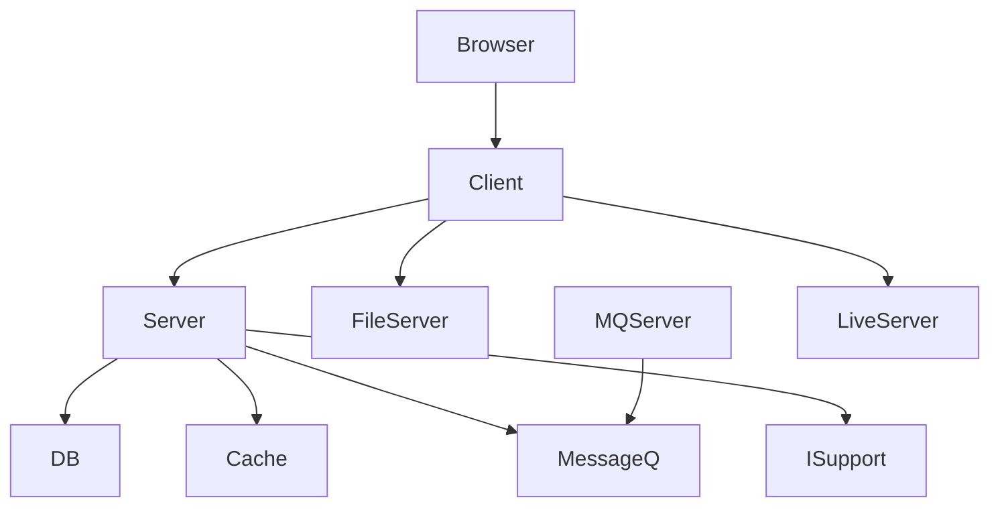
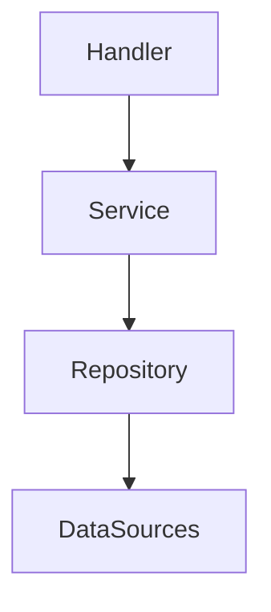
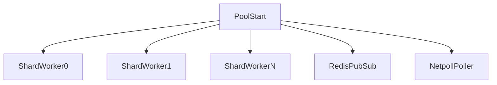
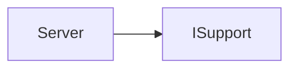
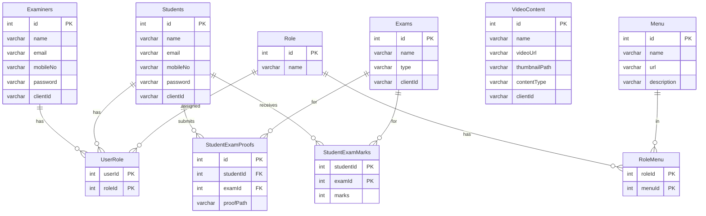

# OES — System Patterns

## High-Level Architecture

The system is composed of **9 Docker containers** on a shared bridge network (`default`). All inter-service communication is by Docker DNS name.

## Container Inventory

| Container | Image / Build | Exposed Port | Role |
|---|---|---|---|
| `oes_client` | `Client/Dockerfile` (Node build → Nginx) | `8080→80` | SPA frontend + reverse proxy |
| `oes_server` | `Server/Dockerfile` (Go binary) | `9000` | REST API + WebSocket hub |
| `oes_fileserver` | `FileServer/Dockerfile` (Go binary) | `8887` | Static file server for media |
| `oes_db` | `MySQL/Dockerfile` (MySQL 8) | `3306` (internal) | Relational data store |
| `cache` | `redis:8.0-alpine` | `6379` (internal) | Session cache + pub/sub bus |
| `messageq` | `rabbitmq:4-alpine` | `5672` | Message broker |
| `oes_mqserver` | `MQServer/Dockerfile` (Go binary + ffmpeg) | — | Async worker: video encode + email |
| `oes_isupport` | `IntelligenceSupport/questgen/Dockerfile` (Python) | `50051` | gRPC question-generation service |
| `oes_liveserver` | `LiveStreamingServer/Dockerfile` (nginx-rtmp) | `1935` | RTMP ingest + HLS/DASH output |

## Nginx Reverse Proxy (Client Container)

The Nginx inside `oes_client` is the **single entry point** for the browser on port `8080`. It routes:

| URL Pattern | Upstream | Notes |
|---|---|---|
| `/api/r/uploadVideoContent` | `server:9000` | 15 MB body limit |
| `/api/r/uploadExamProof` | `server:9000` | 50 MB body limit |
| `/api/r/multipleStudentsRegistration` | `server:9000` | 100 KB body limit |
| `/api/**` | `server:9000` | Strips `/api` prefix |
| `/r/ws` | `server:9000` | WebSocket upgrade headers forwarded |
| `/cdn/**` | `fileserver:8887` | Strips `/cdn` prefix; serves `media/` files |
| `/**` | Vue SPA static files | `try_files` with fallback for history mode routing |

## Server Architecture (Go / Gin)

### Layered Clean Architecture

Each layer communicates only with the layer directly below it through **interfaces** defined in `api/model/`.

### Route Groups & Middleware

| Group prefix | Middleware | Handlers |
|---|---|---|
| `/o` | none (open) | `SignUp`, `Login`, `CheckStatus` |
| `/r` + `Common` | `Auth("Common")` — any logged-in user | `ServeWs`, `GetAllRoutes`, `GetAllVideos`, `Logout` |
| `/r` + `Examiner` | `Auth("Examiner")` | `StudentsRegister`, `QuestionsUpload`, `VideoUpload`, `QuestionGen`, `GetStudents`, `DownloadStudents` |
| `/r` + `Student` | `Auth("Student")` | `UploadExamProof`, `GetQuestions` |

### Authentication Pattern
- Login → bcrypt verify → [`middleware.GenerateJWT()`](Server/api/middleware/middleware.go:27) → JWT (`HS256`) set as `HttpOnly` cookie named `token` (15-minute expiry).
- Every protected request → [`middleware.Auth(role)`](Server/api/middleware/middleware.go:87) extracts cookie, validates JWT, checks `userType` claim against required role, injects `userId`, `userType`, `clientId` into Gin context.

### Multi-tenant Isolation
Every Examiner gets a random **UUID `clientId`** at sign-up. All data (students, videos, exams, files) is scoped by `clientId`, so multiple examiners can share one deployment without seeing each other's data.

## WebSocket Architecture

### Sharded Connection Pool
[`websock.Pool`](Server/util/websock/pool.go:51) uses **32 shards** (FNV hash of `clientId` mod 32) to divide the client map and reduce lock contention.

- **`netpoll`** (edge-triggered epoll) watches all connections; when data arrives, the `*Client` is pushed onto `ClientConnChan`.
- **Worker goroutines** (2× CPU count) read from `ClientConnChan` → call [`websock.Read()`](Server/util/websock/client.go:37) → push message to `pool.Broadcast`.
- **`pool.Broadcast`** publishes to Redis `general` channel.
- **Redis Pub/Sub** subscriber receives message → routes to the correct shard worker channel via FNV hash.
- **Shard worker** holds `RLock` on its shard and writes to the appropriate WebSocket connections.

### WebSocket Message Types

| Type | Direction | Meaning |
|---|---|---|
| 1 | Server → Student(s) | Notification broadcast to all students in a `clientId` group |
| 2 | Any | Text chat |
| 3 | Server → Students | WhiteBoard data broadcast to all students |
| 4 | Peer → Peer | Targeted message (WebRTC signalling — offer/answer/ICE) to specific `userId` |
| 5 | Server → Others | Join/Leave presence event (excludes the joining user) |

### Heartbeat
Every `10s / 32` ticks, one shard is pinged. Clients that do not reply with a Pong within the next tick are removed from the pool.

## Asynchronous Job Pattern (RabbitMQ)

Two durable queues:

| Queue | Publisher | Consumer | Job |
|---|---|---|---|
| `encode` | [`userService.CreateVideoFile()`](Server/api/service/userService.go:50) | `MQServer.HlsVideoConversion()` | Run `ffmpeg` to transcode MP4 → 360p/480p/720p HLS |
| `email` | [`studentService.CreateStudents()`](Server/api/service/studentService.go:94) | `MQServer.SendWelcomeEmail()` | Render HTML template + send via Gmail SMTP |

`MQServer` is a separate Go binary with `ffmpeg` installed. Worker concurrency is bounded by `runtime.NumCPU()`.

## Caching Pattern (Redis)

| Cache Key | Value | TTL | Invalidation |
|---|---|---|---|
| `routes:<userType>` | JSON array of `Route` | 24 h | Never (static menu) |
| `<clientId>` | JSON array of `Video` | 15 min | Deleted on new video upload |
| Redis Pub/Sub `general` channel | WebSocket message payload | Ephemeral | Not stored |

## gRPC Communication

- [`api.go:InitGrpcServiceClient()`](Server/api/api.go:151) dials `isupport:50051` (insecure).
- Proto: [`QuestGenService.QuestGen(QuestGenRequest) → QuestGenResponse`](IntelligenceSupport/questgen/proto/questgen.proto:16).
- Python server listens on `[::]:50051` with `ThreadPoolExecutor(max_workers=10)`.
- Currently the Python implementation is a stub that echoes the input back.

## File Storage Pattern

All user-generated files are stored on a **shared Docker volume** `./media` mounted into three containers:

| Container | Mount path | Usage |
|---|---|---|
| `oes_server` | `/app/OES/media` | Write: uploaded MP4s, exam proof zips, extracted images |
| `oes_fileserver` | `/app/OES/media` | Read: serve any file under `media/` via HTTP |
| `oes_mqserver` | `/app/OES/media` | Read/Write: ffmpeg reads MP4, writes HLS segments, deletes original |

`FileServer` is a minimal Go `http.FileServer` on port `8887`. The client browser accesses it via `/cdn/...` through the Nginx proxy.

## Live Streaming Architecture

`oes_liveserver` uses `nginx-rtmp`:
1. Examiner streams (OBS or browser) → `rtmp://host:1935/live/<stream_name>`.
2. `exec_push` triggers `ffmpeg` to transcode into 4 quality variants (`_low`, `_mid`, `_high`, `_hd720`, `_src`) and push to the internal `show` application.
3. The `show` application writes HLS fragments (3 s chunks, 20-fragment window) to `/mnt/hls/` and DASH fragments to `/mnt/dash/`.
4. Students watch via HLS playlist URL (served from the shared volume or an external CDN).

## Database Schema (MySQL)

## Concurrency Patterns

| Pattern | Location | Details |
|---|---|---|
| Worker pool | [`api.go:initSources()`](Server/api/api.go:47) | `2 × NumCPU` goroutines for `UnzipFile` and WebSocket `Read` |
| Shard workers | [`pool.go:runShardWorker()`](Server/util/websock/pool.go:272) | 32 dedicated write goroutines, one per shard |
| errgroup + semaphore | [`studentService.CreateStudents()`](Server/api/service/studentService.go:66) | Concurrent bcrypt + DB insert bounded by `NumCPU` |
| Channel pipeline | [`handler/studentHandler.go:ResultPaths`](Server/api/handler/studentHandler.go:22) | Buffered channel (200) for async zip processing |
| Singleton connections | [`dalhelper/dalMySQL.go`](Server/util/dalhelper/dalMySQL.go:14) | `sync.Once` for MySQL; Redis & RabbitMQ similar |
